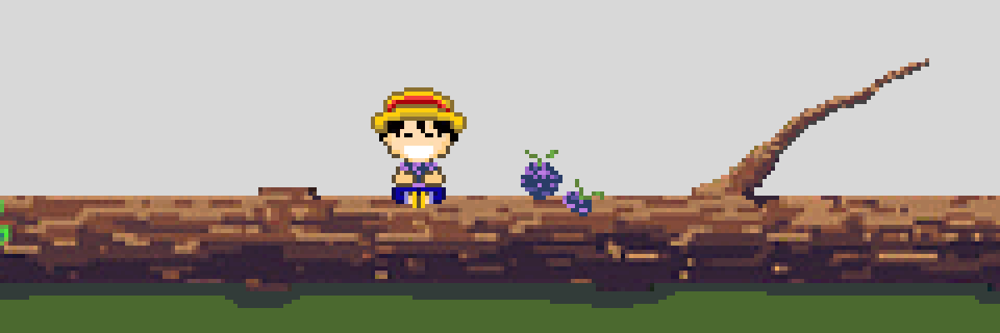

<!-- HEADER -->
<div align="center">

```
░█████╗░███████╗██████╗░██████╗░██████╗░██╗░█████╗░██╗░░██╗██╗░░██╗
██╔══██╗██╔════╝██╔══██╗██╔══██╗██╔══██╗██║██╔══██╗██║░██╔╝╚██╗██╔╝
██║░░╚═╝█████╗░░██║░░██║██║░░██║██████╔╝██║██║░░╚═╝█████═╝░░╚███╔╝░
██║░░██╗██╔══╝░░██║░░██║██║░░██║██╔══██╗██║██║░░██╗██╔═██╗░░██╔██╗░
╚█████╔╝███████╗██████╔╝██████╔╝██║░░██║██║╚█████╔╝██║░╚██╗██╔╝╚██╗
░╚════╝░╚══════╝╚═════╝░╚═════╝░╚═╝░░╚═╝╚═╝░╚════╝░╚═╝░░╚═╝╚═╝░░╚═╝
```

<!-- TECH STACK BADGES -->


<!-- LUFFY GIF -->


</div>

---

<!-- STATS SECTION LABEL -->
<div align="center">

## `[ STATS ]`

<!-- ROW 1: SYSTEM STATS + LANGUAGE MATRIX -->

&nbsp;


<!-- ROW 2: STREAK PROTOCOL CENTERED -->
<br/>


</div>

---

<!-- ACTIVITY GRID - SEPARATE, BIGGER -->
<div align="center">

## `[ ACTIVITY GRID ]`


</div>
